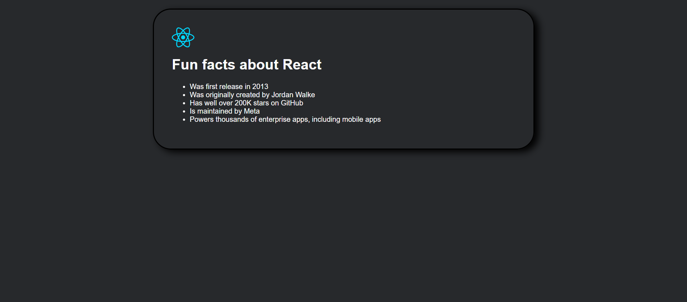

# React Facts - Learning Project (screenshots below)

**Note:** This was a pure learning project. I didn't use any AI-autopilot or auto-code tools. Every single line was written by me to get real hands-on experience with React.

## Overview

This project is a small React application created to practice core React fundamentals.  
The goal was to understand components, JSX, styling, and project structure using Vite, rather than building a feature-heavy app.  

## Features

- Functional React components  
- Clean, component-based structure  
- Styling managed through component-specific CSS files  
- Asset handling using Vite  
- Simple and readable code written for learning purposes  

## Screenshots

### First view


### Halfway through development


### Final version


## Tech Stack

- React (JSX, components)
- Vite (development server + build tool)
- JavaScript (ES6+)
- HTML
- CSS

## File Structure

```
src/
 ├─ assets/
 │   └─ react.svg
 ├─ components/
 │   ├─ Navbar.jsx
 │   ├─ Navbar.css
 │   ├─ Main.jsx
 │   └─ Main.css
 ├─ App.jsx
 ├─ App.css
 ├─ main.jsx
 └─ index.css

public/
 ├─ firstView.png
 ├─ halfway.png
 ├─ final.png
 └─ vite.svg
```

## Purpose

This project was built purely for learning.  
The main focus areas were:

- understanding React's component model  
- practicing JSX  
- organizing files in a clean, modular structure  
- getting comfortable with Vite and React together  

## How to Run

Install dependencies:

```
npm install
```

Start the development server:

```
npm run dev
```
